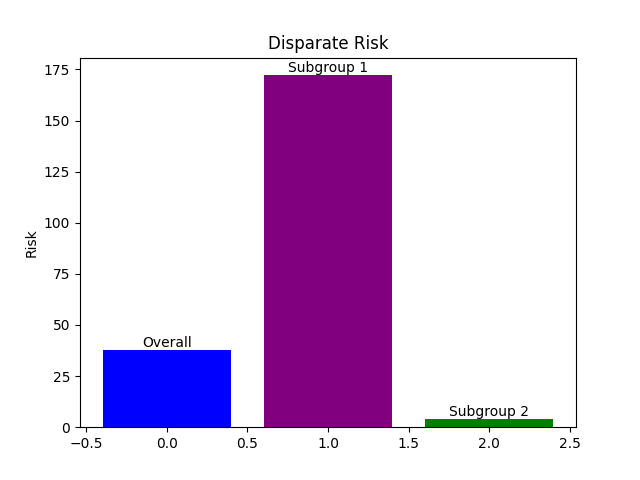
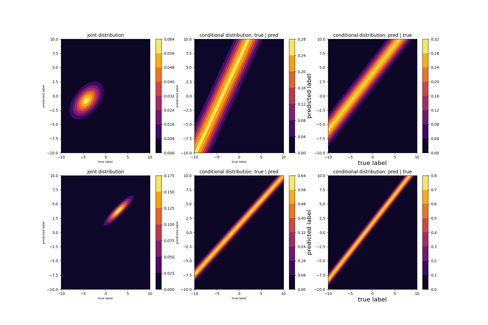
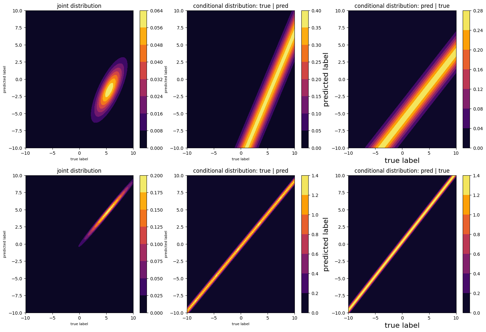
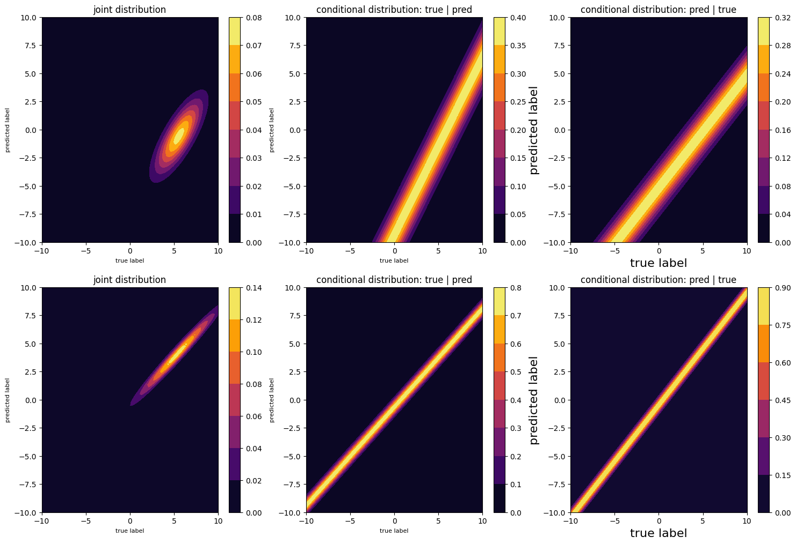
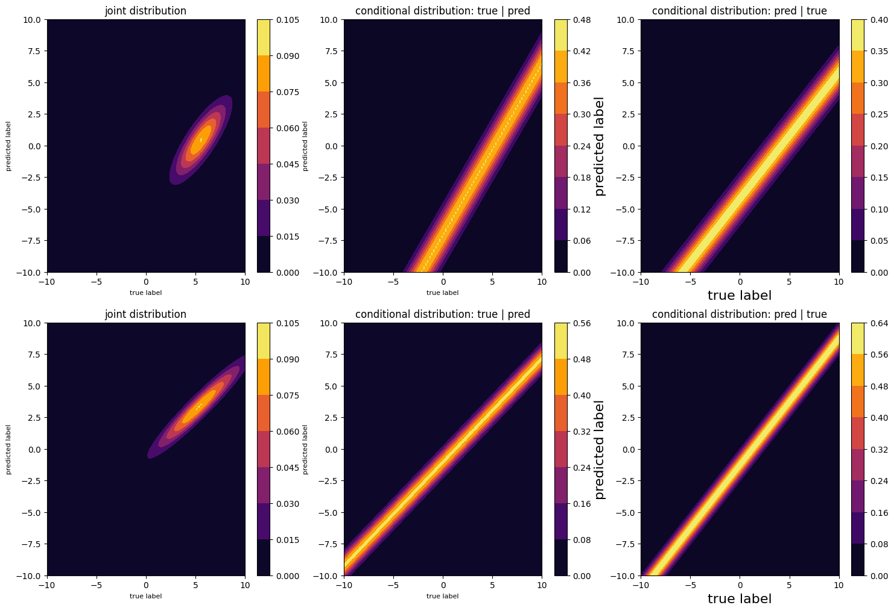
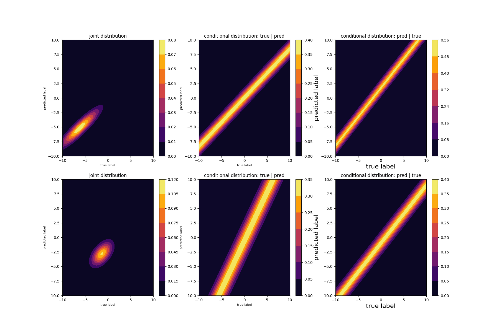
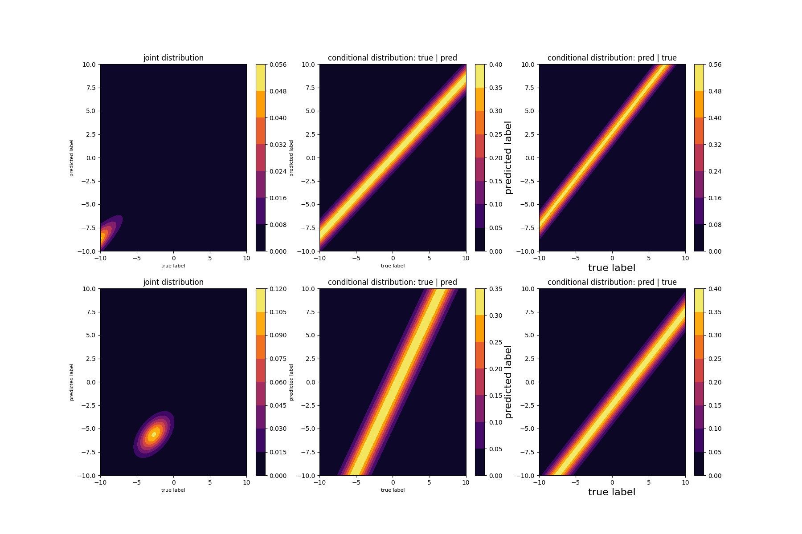
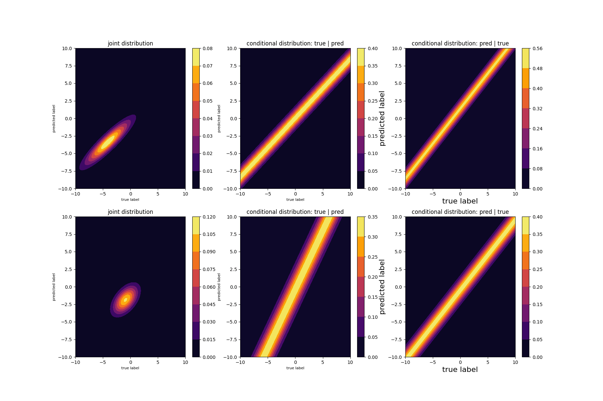
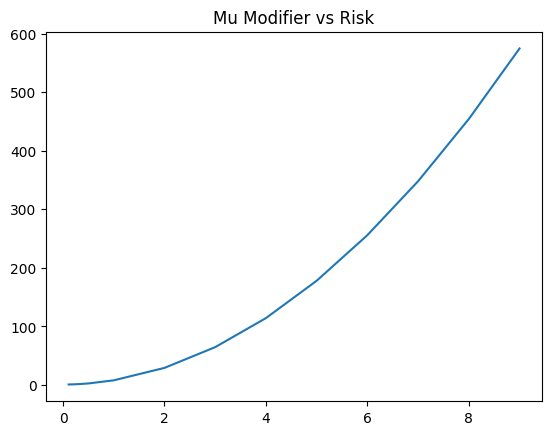

# 08-30 Results Discussion
## Task 1: Derivation of linear-least squares predictor, risk

Starting from the original expression, we can find the optimal predictor by setting the gradient to zero.

$$ 0 = \nabla \mathbb E_{a}\left[\mathbb E_{x,y\sim\mathcal D_a}[(\theta_\star^\top x-y)^2]\right] = \mathbb E_{a}\left[\mathbb E_{x,y\sim\mathcal D_a}[\nabla (\theta_\star^\top x-y)^2]\right]$$
$$= \mathbb E_{a}\left[\mathbb E_{x,y\sim\mathcal D_a}[2x(x^\top\theta_\star - y)]\right] = \mathbb E_{a}\left[\mathbb E_{x,y\sim\mathcal D_a}[xx^\top\theta_\star - yx)]\right]$$

We solve the expectations on x and y:
$$\mathbb E [xx^\top] = \Sigma_a + \mu_a\mu_a^\top$$
$$\mathbb E [yx] = \mathbb E [(\theta_a^\top x + v) x] = \mathbb E [xx^\top \theta_a + vx] = (\Sigma_a + \mu_a \mu_a^\top) \theta_a$$

And plug these in to our expression yielding the linear least-squares predictor:

$$= \mathbb E_{a}\left[(\Sigma_a + \mu_a\mu_a^\top)\theta_\star - (\Sigma_a + \mu_a \mu_a^\top) \theta_a\right]$$
$$\theta_\star\mathbb E_{a}\left[\Sigma_a + \mu_a\mu_a^\top\right] = E_{a}\left[(\Sigma_a + \mu_a \mu_a^\top) \theta_a\right]$$
$$\theta_\star = \left(\mathbb E_{a}\left[\Sigma_a + \mu_a\mu_a^\top\right]\right)^{\dag} \left(E_{a}\left[(\Sigma_a + \mu_a \mu_a^\top) \theta_a\right]\right)$$
$$\theta_\star = \left[\sum_a p_a (\Sigma_a + \mu_a\mu_a^\top)\right]^{\dag} \left[\sum_a p_a(\Sigma_a + \mu_a \mu_a^\top) \theta_a\right]$$

Next we start from the expression for risk:

$$\mathcal R(\theta_\star) = \mathbb E_{a}\left[\mathbb E_{x,y\sim\mathcal D_a}[(\theta_\star^\top x-y)^2]\right] $$
$$= \mathbb E_{a}\left[\mathbb E_{x,y\sim\mathcal D_a}[x^\top \theta_\star \theta_\star^\top x - 2y\theta_\star^\top x + y^2]\right]$$

And solve the expectation for each of the terms:
$$\mathbb E [x^\top \theta_\star \theta_\star^\top x]= \theta_\star^\top \theta_\star \mathbb E[x^\top x] = \theta_\star^\top \theta_\star (\Sigma_a + \mu_a \mu_a^\top)$$
$$\mathbb E[2y\theta_\star^\top x]= 2\theta_\star^\top \mathbb E [yx] = 2\theta_\star^\top (\Sigma_a + \mu_a \mu_a^\top)\theta_a$$
$$\mathbb E [y^2]= \mathbb E [(\theta_a^\top x + v)^2] = \mathbb E [x^\top \theta_a \theta_a^\top x + 2v \theta_a^\top x + v^2]$$
$$= \theta_a^\top \theta_a (\Sigma_a + \mu_a \mu_a^\top) + \sigma_a^2$$

Then we plug these terms back in to the risk expression and simplify:

$$\mathcal R(\theta_\star) = \mathbb E_{a}\left[\theta_\star^\top \theta_\star (\Sigma_a + \mu_a \mu_a^\top) - 2\theta_\star^\top (\Sigma_a + \mu_a \mu_a^\top)\theta_a] + \theta_a^\top \theta_a (\Sigma_a + \mu_a \mu_a^\top) + \sigma_a^2\right]$$
$$= \mathbb E_{a}\left[(\theta_\star - \theta_a)^\top(\Sigma_a + \mu_a \mu _a^\top)(\theta_\star - \theta_a) + \sigma_a^2\right]$$
$$= \sum_a p_a\left[(\theta_\star - \theta_a)^\top(\Sigma_a + \mu_a \mu _a^\top)(\theta_\star - \theta_a) + \sigma_a^2\right]$$

To write everything in terms of the given values, we can plug in the derived expression for $\theta_\star$ from above.

## Task 2: Disparate Accuracy

I created 2 subpopulations:

* **proportions** = [0.2, 0.8]
* **mus**: randomly sampled from uniform(-10, 10)
* **Sigmas**: randomly sampled some $S$ from uniform(-1, 1) and then set $Sigmas = S.T @ S$ for each subgroup following method from prev. homework to ensure invertibility.
* **sigmas**: randomly samples from uniform (-1, 1)
* **thetas**: randomly samples from uniform (-1, 1)

|            | Risk  |
|------------|-------|
| Overall    | 37.76 |
| Subgroup 1 | 172.1 |
| Subgroup 2 | 4.159 |

### Visualize Distributions of true and predicted labels

We derive the distributions needed to visualize the probability density functions. As the derivations are very similar, the second variance derivation has been made slightly more brief.

$$\begin{aligned}
    \mathbb E [\hat{y} | a]  &= \theta_\star^\top \mu_a\\
    Var[\hat{y} | a] &= \mathbb{E} \left[(\theta_\star^\top x - \mathbb{E}(\theta_\star^\top x))^2\right] \\
    &= \mathbb{E} \left[(\theta_\star^\top x - \theta_\star^\top\mathbb{E}( x))^2\right] \\
    &= \mathbb{E} \left[x^\top\theta_\star\theta_\star^\top x - 2x^\top\theta_\star\theta_\star^\top\mathbb{E}(x) + \mathbb{E}(x)^\top\theta_\star\theta_\star^\top\mathbb{E}(x)\right] \\
    &= \theta_\star^\top\mathbb{E}[x^\top x]\theta_\star - \theta_\star^\top\mathbb{E}[x]\mathbb{E}[x]^\top\theta_\star \\
    &= \theta_\star^\top(\mathbb{E}[x^\top x] - \mathbb{E}[x]\mathbb{E}[x]^\top)\theta_\star \\
    &= \theta_\star^\top\Sigma_a\theta_\star \\
    \mathbb{E}[y|a] &= \mathbb{E}[\theta_a^\top x + v] = \theta_a^\top \mu_a \\
    Var[y|a] &= \mathbb{E}\left[(\theta_a^\top x + v)^2\right] - \mathbb{E}[\theta_a^\top x + v]^2 \\
    &=\theta_a^\top \mathbb{E}[x^\top x] \theta_a + \sigma^2 - \mu_a^\top \theta_a \theta_a^\top \mu_a \\
    &= \theta_a^\top \mathbb{E}[x^\top x] \theta_a + \sigma^2 - \theta_a^\top \mathbb{E}[x]^2 \theta_a\\
    &= \theta_a^\top \Sigma_a \theta_a + \sigma^2
\end{aligned}$$

Next we derive the joint distribution:
$$\begin{aligned}
    Cov(y, \hat{y}) &= \mathbb{E}[(y - \mathbb{E}[y])(\hat{y} - \mathbb{E}[\hat{y}])] \\
    &= \mathbb{E}[y\hat{y} - \hat{y}\mathbb{E}[y] - y\mathbb{E}[\hat{y}] + \mathbb{E}[y]\mathbb{E}[\hat{y}]] \\
    &= \mathbb{E}[y\hat{y}] - \mathbb{E}[\hat{y}]\mathbb{E}[y] \\
    &= \theta_a^\top x \theta_\star^\top x + \theta_\star^\top xv - (\theta_a^\top \mu_a \theta_\star^\top \mu_a) \\
    &= \theta_a^\top \Sigma_a \theta_\star
\end{aligned}$$

Thus 
$$\begin{aligned}
    \begin{bmatrix}
y \\
\hat{y} 
\end{bmatrix} \sim \mathcal{N}\left(\begin{bmatrix}
\theta_a^\top \mu_a \\
\theta_\star^\top \mu_a 
\end{bmatrix},\,\begin{bmatrix}
\theta_a^\top \Sigma_a \theta_a + \sigma^2 & \theta_a^\top \Sigma_a \theta_\star \\
\theta_a^\top \Sigma_a \theta_\star & \theta_\star^\top\Sigma_a\theta_\star 
\end{bmatrix}\right)
\end{aligned}$$

For the conditional distributions I use the equations below that have been simplified from https://en.wikipedia.org/wiki/Multivariate_normal_distribution#Bivariate_conditional_expectation:

$$\begin{aligned}
    \mathbb{E}[Y|X] &= \mu_y + \frac{Cov(X, Y)}{\sigma_x^2}(X - \mu_x) \\
    Var[Y | X] &= \sigma_Y^2 - \frac{Cov(X, Y)^2}{\sigma_x^2}
\end{aligned}$$

$$\begin{aligned}
    y|\hat{y}, a \sim \mathcal{N}\left(
    \theta_a^\top \mu_a + \frac{\theta_a^\top \Sigma_a \theta_\star}{\theta_\star^\top \Sigma_a \theta_\star}(\hat{y} - \theta_\star^\top \mu_a)
    , \, 
    \theta_a^\top \Sigma_a \theta_a + \sigma^2 - \frac{(\theta_a^\top \Sigma_a \theta_\star)^2}{\theta_\star^\top\Sigma_a\theta_\star}
    \right) \\
    \hat{y}|y, a \sim \mathcal{N}\left(
    \theta_\star^\top \mu_a + \frac{\theta_a^\top \Sigma_a \theta_\star}{\theta_a^\top \Sigma_a \theta_a}(y - \theta_a^\top \mu_a)
    , \, 
    \theta_\star^\top \Sigma_a \theta_\star - \frac{(\theta_a^\top \Sigma_a \theta_\star)^2}{\theta_a^\top\Sigma_a\theta_a}
    \right)
\end{aligned}$$

This yields the following heatmaps: 

In the above graphic, I first plot joint distribution of true and predicted labels, followed by conditional distribution of true labels given predicted labels followed by conditional distribution of predicted labels given true labels. The top three graphs represent the first subpopulation and the bottom three are for the second. We can see that population 2 has a low variance, indicated by its narrow heatmap lines. It also made up a larger proportion of the overall population. Additionally, we can see that the two conditional distributions for population 2 are more similar and aligned (in the y=x sense). This makes sense given the lower risk value of population 2 relative to population 1.

### Task 3: Disparate prediction deep dive

First, I investigate the effects of varying population size when all other parameters are the same. I report the proportions used as [P(Subgroup 1), P(Subgroup 2)] and the risk values in the format [Overall, Subgroup 1, Subgroup 2].

|  | 
|:--:| 
| *proportions = [0.1, 0.9]* |
| *Risk = [5.44, 51.4, 0.32]* |

|  | 
|:--:| 
| *proportions = [0.3, 0.7]* |
| *Risk = [13.4, 33,4, 4.88]* |

|  | 
|:--:| 
| *proportions = [0.5, 0.5]* |
| *Risk = [16.69, 18.5, 14.8]* |

We can see that as the proportions become more equal, the overall risk is increases, as the least-squares predictor must attempt to align with two balanced but different distributions. The subpopulation with the lower proportion consistently has higher risk - this makes sense as aligning with the larger subpopulation to yield a lower risk is more beneficial to minimizing the overall risk value.

Next, I examine the effect of having more or less similar mu (mean) values on the distributions and keep all other parameters the same. The proportions are equal for both subgroups:

|  | 
|:--:| 
| *original mu* |
| *Risk = [16.7, 6.94, 26.47]* |

|  | 
|:--:| 
| *original mu * 2* |
| *Risk = [64.5, 27.8, 101.2]* |

|  | 
|:--:| 
| *original mu / 3* |
| *Risk = [7.85, 3.08, 12.6]* |

The most interesting changes here are in the overall risk values. Starting with a baseline of 16.7, the risk when the means are doubled increases, while the risk when the mu is divided by a constant decreases. The relationship does not seem to be linear, and I was interested to see the relationship.

|  | 
|:--:| 
| *Risk as Mus are more varied* |

I plotted the relationship between risk and how different mu values are from each other. Starting from an original set of mus, I divided and multiplied the matrix by values ranging from 1 to 10. I then plotted the resulting overall risks. Multiplying not only increases the values of the mus but also makes them more different from each other, while dividing decreases and makes the mus more similar.